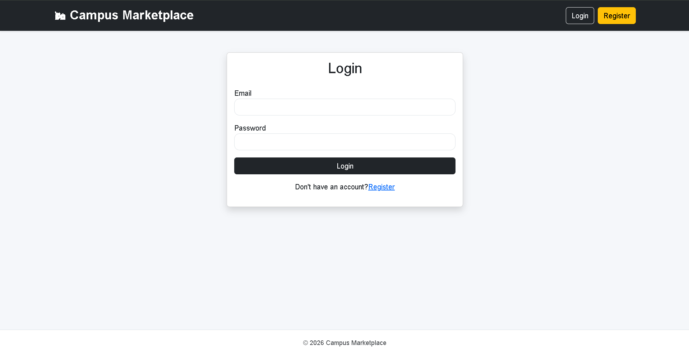
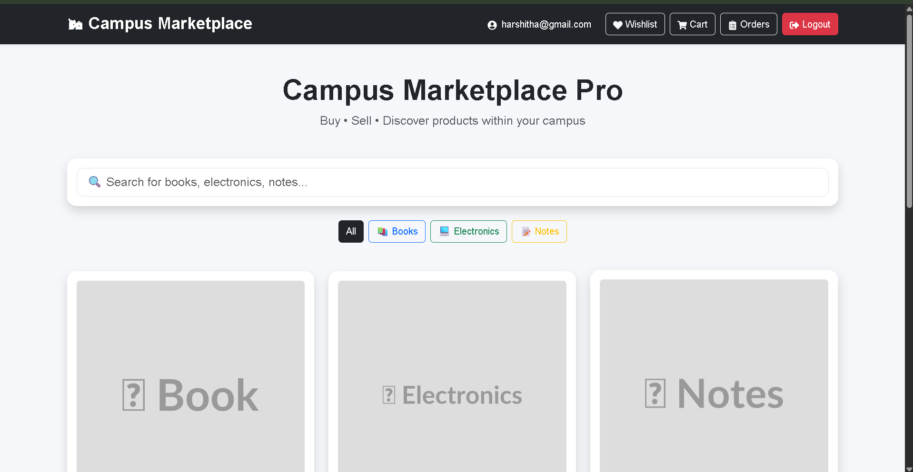
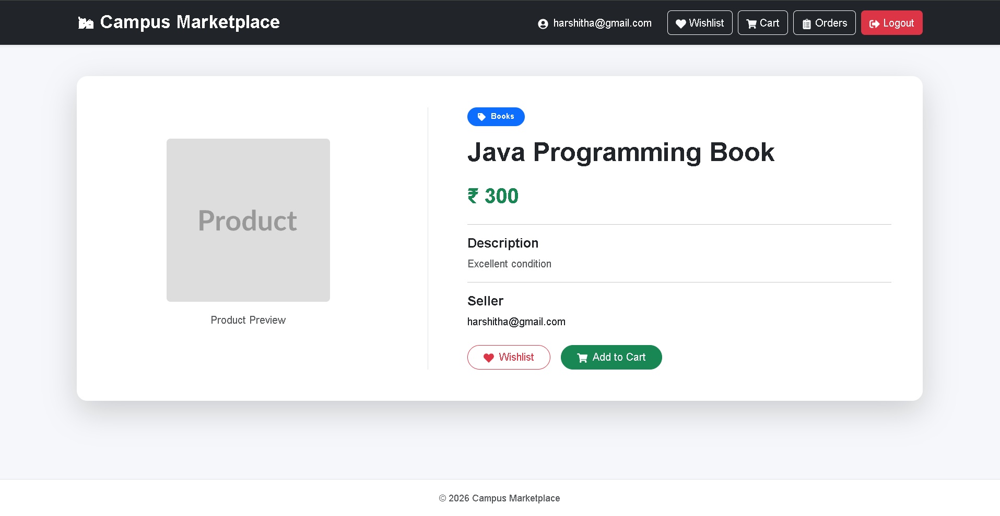
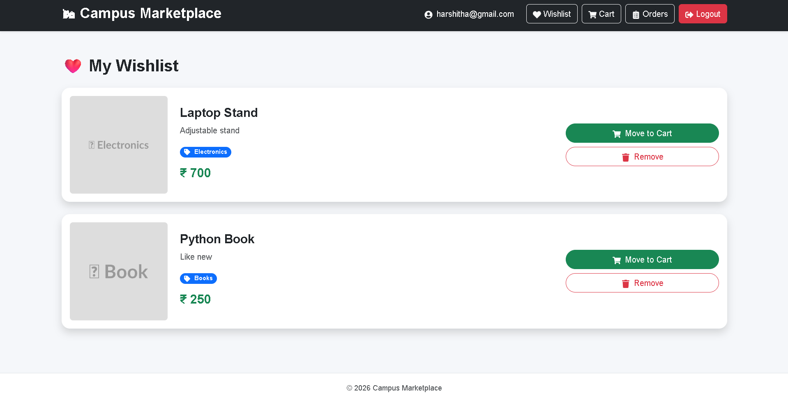
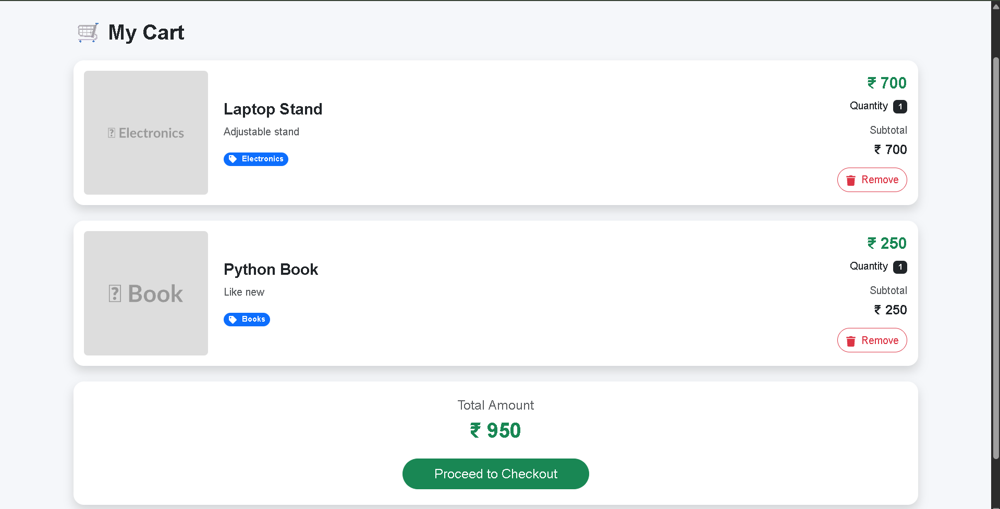
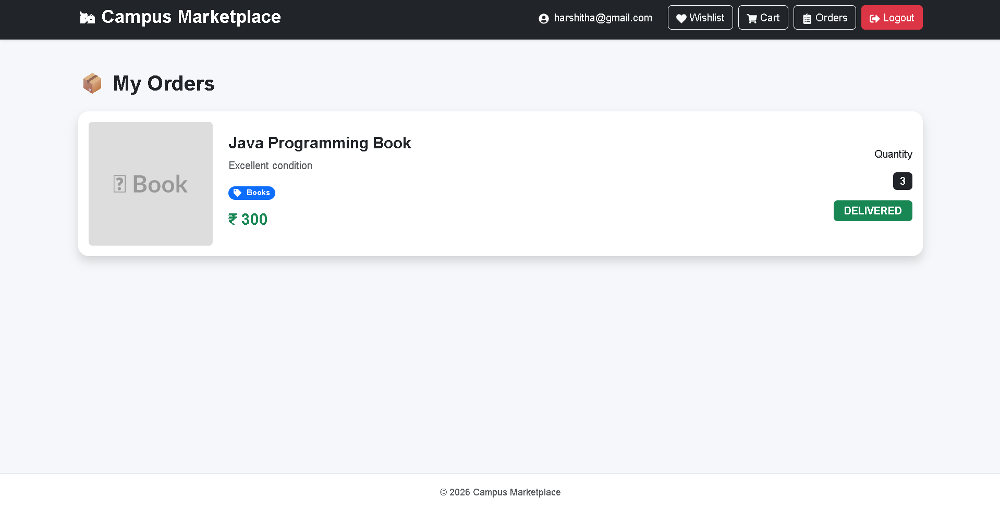

# 🛍️ Campus Marketplace Pro

A full-stack marketplace application built for college students to buy, sell, wishlist, and purchase products securely within their campus.

The project is built using **Spring Boot**, **React**, **PostgreSQL**, **Redis**, and **JWT Authentication** with a clean and responsive user interface.

---

## 🚀 Features

### 👤 Authentication
- User Registration
- Secure Login
- JWT Authentication
- Protected APIs
- Logout

### 🛍️ Product Management
- View all products
- Product Details page
- Search products
- Category filters
- Seller information

### ❤️ Wishlist
- Add products to wishlist
- Remove products from wishlist
- Move wishlist items to cart

### 🛒 Shopping Cart
- Add to cart
- Update quantity automatically
- Remove products
- Calculate subtotal
- Calculate total amount

### 📦 Orders
- Place orders
- View previous orders
- Track order status
- Display product information with each order

### ⭐ Reviews
- Add reviews
- View product reviews
- Rating support

### 📊 Admin Features
- Product statistics
- Revenue statistics
- User statistics
- AI recommendation endpoint

### ⚡ Performance
- Redis Caching
- Faster product retrieval
- Reduced database queries

### 🎨 Frontend
- Responsive UI
- Toast Notifications
- Loading Spinner
- Empty State Components
- Reusable Components
- Modern Bootstrap Design

---

# 🛠️ Tech Stack

## Frontend
- React
- React Router DOM
- Axios
- Bootstrap 5
- React Icons
- React Toastify

## Backend
- Java 24
- Spring Boot
- Spring Security
- Spring Data JPA
- Maven
- JWT Authentication

## Database
- PostgreSQL

## Cache
- Redis

## Tools
- Docker
- Git
- GitHub
- Postman
- VS Code

---

# 🏗️ Project Architecture

```
                React Frontend
                      │
                  Axios API
                      │
             Spring Boot Backend
                      │
      ┌───────────────┴───────────────┐
      │                               │
 PostgreSQL Database            Redis Cache
```

---

# 📂 Project Structure

```
campusmarketplacepro
│
├── backend
│   ├── controller
│   ├── service
│   ├── repository
│   ├── entity
│   ├── dto
│   ├── security
│   └── config
│
├── frontend
│   ├── components
│   ├── pages
│   ├── services
│   ├── assets
│   └── styles
│
├── screenshots
│
├── README.md
└── .gitignore
```

---

# ⚙️ Installation

## Clone the repository

```bash
git clone https://github.com/Harshitha418/campus-marketplace-pro.git
```

---

## Backend Setup

```bash
cd backend
```

Configure PostgreSQL database in

```
application.properties
```

Start Redis using Docker

```bash
docker start redis-cache
```

Run Spring Boot

```bash
./mvnw spring-boot:run
```

---

## Frontend Setup

```bash
cd frontend
npm install
npm run dev
```

Frontend runs at

```
http://localhost:5173
```

Backend runs at

```
http://localhost:8080
```

---

# 🔐 Authentication

The application uses **JWT Authentication**.

After successful login:

- JWT Token is generated
- Token is stored in Local Storage
- Axios automatically attaches the token
- Protected APIs validate the JWT before processing requests

---

# ⚡ Redis Caching

Redis is used to cache product data.

Benefits:

- Faster API response
- Reduced PostgreSQL load
- Improved application performance

---

# 📷 Screenshots

## Login



---

## Home



---

## Product Details



---

## Wishlist



---

## Cart



---

## Orders



---

# 🚀 Future Improvements

- Product image upload
- Online payment integration
- Email notifications
- Admin analytics dashboard
- Chat between buyer and seller
- Product recommendation using Machine Learning
- Dark Mode
- Mobile App

---

# 👩‍💻 Author

**M P Harshitha **

Artificial Intelligence & Machine Learning

BMS College of Engineering

GitHub: https://github.com/Harshitha418

---

# ⭐ If you like this project

Give this repository a ⭐ on GitHub.